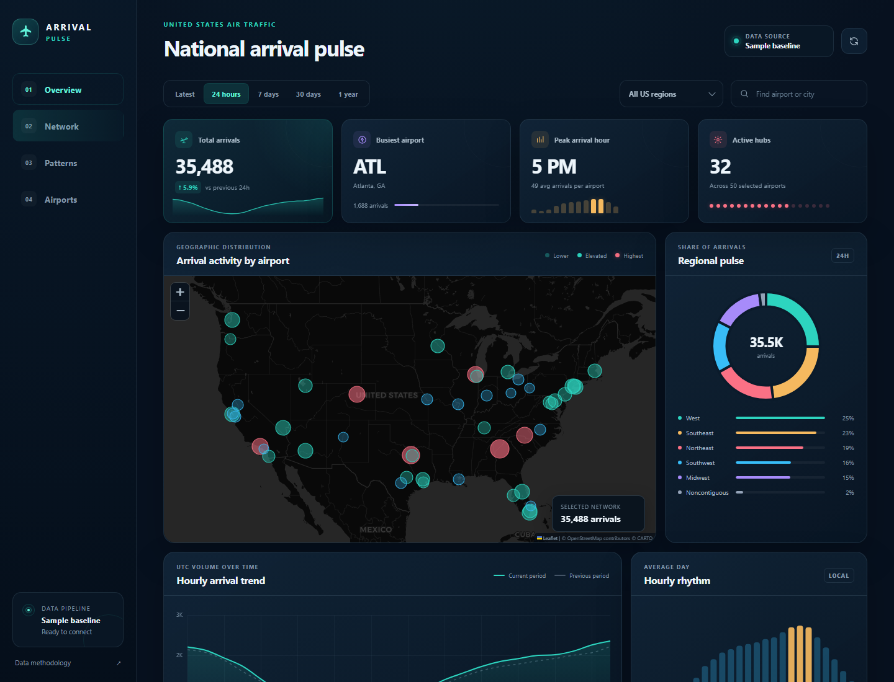

# Arrival Pulse

A responsive, static dashboard for exploring flight-arrival patterns across 50 major United States airports. It runs on GitHub Pages with no paid server, database, or frontend build step.



## What it includes

- Interactive airport activity map
- Latest, 24-hour, 7-day, 30-day, and 1-year views
- Arrival totals, busiest hub, peak hour, and active-airport metrics
- Regional share, trend, hourly rhythm, rankings, and weekday/hour heatmap
- Region and airport search filters
- Deterministic sample history so every view works before an API is connected
- Hourly OpenSky collection through GitHub Actions
- Automatic GitHub Pages deployment

## Run locally

The app is plain HTML, CSS, and JavaScript. Serve the repository root so the browser can load the JSON files:

```powershell
python -m http.server 8000
```

Then open `http://localhost:8000`.

## Publish for free

1. Push the repository to GitHub.
2. Open **Settings → Pages**.
3. Under **Build and deployment**, choose **GitHub Actions**.
4. Run the **Refresh data and deploy dashboard** workflow, or push to `main`.

The workflow in `.github/workflows/pages.yml` deploys the static site. Its scheduled run starts at minute 17 of every hour.

## Connect OpenSky

GitHub Pages cannot safely hold API secrets in browser JavaScript. The included workflow keeps credentials in GitHub Actions and publishes only aggregated counts.

1. Create an account at [OpenSky Network](https://opensky-network.org/).
2. Create an OAuth API client from the OpenSky account page.
3. In the GitHub repository, open **Settings → Secrets and variables → Actions**.
4. Add these repository secrets:

```text
OPENSKY_CLIENT_ID
OPENSKY_CLIENT_SECRET
```

5. Run the workflow manually from the **Actions** tab.

Credentials are strongly recommended. Without them, the collector attempts OpenSky's smaller anonymous quota, which may be exhausted on shared GitHub runner IP addresses.

## How the data works

`scripts/update_data.py` requests OpenSky's completed flights for the previous two full UTC hours, counts records by `estArrivalAirport`, and stores aggregate hourly buckets in `data/arrivals.json`.

- Only airports in `data/airports.json` are shown.
- Observed data is retained for 45 days to keep the static JSON small.
- Missing hours and longer history use the deterministic sample baseline.
- The dashboard labels whether the current view is sample, observed, or mixed.
- "Latest" means the latest completed hourly bucket. It is near-live, not second-by-second radar data.

OpenSky may revise availability, quotas, and endpoint behavior. Review its [REST API documentation](https://openskynetwork.github.io/opensky-api/rest.html) and terms before public or high-volume use.

## Customize airport coverage

Edit `data/airports.json`. Each airport needs:

```json
{
  "iata": "ATL",
  "icao": "KATL",
  "name": "Hartsfield-Jackson Atlanta",
  "city": "Atlanta",
  "state": "GA",
  "region": "Southeast",
  "lat": 33.6407,
  "lon": -84.4277,
  "utcOffset": -5,
  "base": 78
}
```

`base` controls the airport's modeled sample volume. `utcOffset` is used only for the local-hour sample pattern.

## Data sources

- Flight observations: [OpenSky Network](https://opensky-network.org/)
- Airport metadata structure: [OurAirports open data](https://ourairports.com/data/)
- Map tiles: [OpenStreetMap](https://www.openstreetmap.org/) and [CARTO](https://carto.com/)

This dashboard is an analytical visualization, not an operational aviation or safety system.
